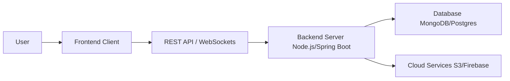

# Harsh Dubey — Full Stack Developer

I build modern, scalable, and responsive web applications using state-of-the-art technologies such as React, Node.js, Express.js, MongoDB, and Java/Spring Boot.

🌐 **Live Portfolio:** [https://harshdubey.me](https://harshdubey.me)

---
---

## 👨‍💻 About Me

- **Role:** Full Stack Developer
- **Education:** B.Tech in Computer Science and Design
- **Passion:** I am highly passionate about software development and have a deep interest in building real-world applications that solve actual problems.
- **Expertise:** I specialize in both frontend and backend development, focusing on scalable systems, seamless user experiences, and modern technologies.
- **Drive:** I believe in continuous learning and always strive to stay up-to-date with the latest industry standards.

---

## 🚀 What I Do

| **Domain** | **Description** |
| :--- | :--- |
| 🎨 **Frontend Development** | Creating beautiful, responsive, and highly interactive user interfaces using React, Tailwind CSS, and Framer Motion. |
| ⚙️ **Backend Development** | Architecting robust server-side logic and scalable architectures with Node.js, Express, and Spring Boot. |
| 🔌 **REST API Development** | Designing secure, efficient, and well-documented RESTful APIs for seamless client-server communication. |
| 🗄️ **Database Design** | Structuring and optimizing data flow utilizing NoSQL databases like MongoDB and Mongoose. |
| 🔒 **Auth & Security** | Implementing modern authentication and authorization flows to keep user data secure. |
| ⚡ **Real-Time Applications**| Building low-latency, real-time features using WebSockets and Socket.IO. |
| 📱 **Responsive UI** | Ensuring pixel-perfect and fluid experiences across all devices (Desktop, Tablet, Mobile). |
| ☁️ **Cloud & Deployment** | Managing assets and deployments using AWS S3, Cloudinary, and Firebase. |

---

## 🛠️ Tech Stack

### Languages


### Frontend


### Backend


### Database


### Cloud / Services


### Tools


---

## 🏆 Featured Projects

My portfolio website acts as the central hub to showcase my skills and full-stack applications.


*(For actual project links and deep dives, visit [https://harshdubey.me](https://harshdubey.me))*

---

## ✨ Portfolio Features

The deployed portfolio website highlights the following technical capabilities:

- **Responsive Design:** Fluidly adapts to everything from large desktop monitors to tiny mobile screens.
- **Modern UI:** Built with a keen eye for aesthetics, typography, and spacing.
- **Smooth Animations:** Enhances user experience without compromising performance.
- **Projects Showcase:** Dedicated section to highlight my best work.
- **Skills Section:** A structured breakdown of my technical capabilities.
- **About & Contact:** Cleanly integrated sections for networking and outreach.

---

## 🏗️ Architecture / Technical Approach

My full-stack development workflow follows a robust, decoupled architecture:



---

## 💻 Installation & Local Development

Want to run this portfolio locally? Follow these steps:

1. **Clone the repository:**
   ```bash
   git clone https://github.com/Harshdubey9670/myPortfoilio.git
   cd myPortfoilio
   ```

2. **Install dependencies:**
   ```bash
   npm install
   ```

3. **Start the development server:**
   ```bash
   npm run dev
   ```

---

## 🔐 Environment Variables

If you are setting up the project locally, create a `.env` file in the root directory and configure your variables. 

```env
VITE_API_URL=http://localhost:5000
VITE_SOME_KEY=your_key_here
```
> **Important:** Never commit actual secrets or API keys to GitHub. Always use a `.env.example` file for reference.

---

## 📦 Build & Deployment

To create a production-ready build:

```bash
npm run build
npm run preview
```

The production portfolio is successfully deployed and live at: **[https://harshdubey.me](https://harshdubey.me)**

---

## 📁 Folder Structure

A representative layout of a modern React/Vite architecture (adjust according to the actual repository):

```text
project/
├── public/
├── src/
│   ├── assets/
│   ├── components/
│   ├── pages/
│   ├── hooks/
│   ├── services/
│   ├── store/
│   ├── utils/
│   ├── App.tsx
│   └── main.tsx
├── screenshots/
├── .env.example
├── package.json
└── README.md
```

---

## 📱 Responsive Design

This portfolio guarantees an excellent and consistent experience across all standard device breakpoints:
- 🖥️ **Desktop**
- 💻 **Laptop**
- 📱 **Tablet**
- ☎️ **Mobile**

---

## 📈 Learning & Goals

I am continuously leveling up my skills to build better software. My current focuses include:
- Mastering advanced System Design
- Architecting highly Scalable Applications
- Deepening my knowledge of Cloud Technologies & Docker
- Exploring AI-powered application integrations

---

## 📫 Contact

Feel free to reach out to me for collaboration, freelance opportunities, or just a quick chat!

- **Portfolio:** [https://harshdubey.me](https://harshdubey.me)
- **GitHub:** [github.com/Harshdubey9670](https://github.com/Harshdubey9670)
- **LinkedIn:** [linkedin.com/in/harsh-dubey-32b33032b](https://www.linkedin.com/in/harsh-dubey-32b33032b/)
- **Email:** [harshdubey112005@gmail.com](mailto:harshdubey112005@gmail.com)

---

Thanks for visiting my portfolio and GitHub profile. Feel free to explore my projects and connect with me. 

**[https://harshdubey.me](https://harshdubey.me)**
