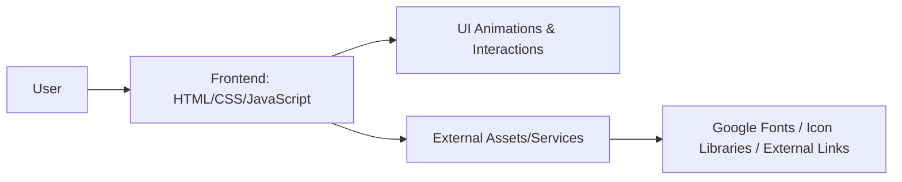

# Harsh Dubey — Full Stack Developer

I build modern, scalable, and responsive web applications with **React**, **Node.js**, **Express.js**, **MongoDB**, and **Java/Spring Boot**.  
This repository contains my deployed personal portfolio website.

🌐 **Portfolio:** [https://harshdubey.me](https://harshdubey.me)

---

## Portfolio Preview


> Add the screenshot file at `./screenshots/portfolio.png` (inside a `screenshots` folder in this repository).

---

## About Me

I’m a **Full Stack Developer** pursuing **B.Tech in Computer Science and Design**. I enjoy building real-world software products across frontend and backend, with a strong focus on clean user experiences, practical architecture, and continuous learning. I’m especially interested in scalable systems and modern development technologies.

---

## What I Do

| Area | Focus |
|------|-------|
| 🎨 Frontend Development | Building responsive, interactive interfaces with modern JavaScript/TypeScript frameworks |
| ⚙️ Backend Development | Designing robust server-side applications and scalable service layers |
| 🔌 REST API Development | Creating clean, maintainable APIs for web and mobile applications |
| 🗄️ Database Design | Structuring data models and optimizing data flow for application needs |
| 🔐 Authentication & Authorization | Implementing secure access control and user identity workflows |
| ⚡ Real-Time Applications | Building live, event-driven experiences using Socket-based communication |
| 📱 Responsive UI Development | Delivering consistent UX across desktop, tablet, and mobile screens |
| ☁️ Cloud & Deployment | Integrating cloud services and production-ready deployment workflows |

---

## Tech Stack

### Languages


### Frontend


### Backend


### Database


### Cloud / Services


### Tools


---

## Featured Projects

This portfolio highlights selected work across frontend and full-stack development.

### 1) MINDMATE AI
- **Description:** Mental wellness chatbot with switchable personas and modern UI.
- **Technologies:** React, TypeScript, Vite, Tailwind CSS
- **Key Features:** Persona switching, conversational UI, responsive design
- **GitHub:** `[Add GitHub URL]`
- **Live Demo:** http://mindmateaichat.vercel.app

### 2) Esport Tournament
- **Description:** Tournament-focused application for registration and scheduling workflows.
- **Technologies:** Flutter, Dart, Authentication
- **Key Features:** Registration flow, scheduling modules, mobile-oriented UX
- **GitHub:** `[Add GitHub URL]`
- **Live Demo:** https://grandbattlearena.netlify.app

### 3) Personal Portfolio
- **Description:** Personal developer portfolio website and project showcase.
- **Technologies:** HTML5, CSS3, JavaScript, WebGL
- **Key Features:** Animated UI, structured sections, project showcase
- **GitHub:** `[Add GitHub URL]`
- **Live Demo:** https://harshdubey.me

### Additional Project Placeholder
- **Project Name:** `[Add Project Name]`
- **Description:** `[Add short project summary]`
- **Technologies:** `[Add technologies used]`
- **Key Features:** `[Add key features]`
- **GitHub:** `[Add GitHub URL]`
- **Live Demo:** `[Add Live Demo URL]`

---

## Portfolio Features

Based on the current deployed portfolio implementation:

- Responsive layout for multiple screen sizes
- Modern UI styling with animations and interactive sections
- Project showcase section
- Skills section
- About section
- Contact section
- Social profile links
- Mobile-friendly navigation pattern

> If new features are added later (for example, theme toggles or backend integrations), this section can be updated accordingly.

---

## Architecture / Technical Approach

This portfolio is currently implemented as a frontend-first, deployed web experience.



---

## Installation & Local Development

```bash
git clone <repository-url>
cd <project-folder>
npm install
npm run dev
```

> Replace `<repository-url>` with the actual GitHub repository URL.
> If this portfolio is being run as a static site without a Node-based dev server, open `index.html` directly or use your preferred local static server.

---

## Environment Variables

If environment variables are used in future updates, define them in a local `.env` file:

```env
VITE_API_URL=
VITE_...
```

Never commit API keys, tokens, or secrets to GitHub.  
Use `.env`/`.env.local` and keep them out of version control.

---

## Build & Deployment

```bash
npm run build
npm run preview
```

Production portfolio: **https://harshdubey.me**

> Hosting provider is not specified in this repository; update this section when deployment details are finalized.

---

## Folder Structure (Representative)

```text
project/
├── public/
├── src/
│   ├── assets/
│   ├── components/
│   ├── pages/
│   ├── hooks/
│   ├── services/
│   ├── store/
│   ├── utils/
│   ├── App.tsx
│   └── main.tsx
├── screenshots/
├── .env.example
├── package.json
└── README.md
```

This structure is representative of a modern React/Vite portfolio setup and should be adjusted to match the actual repository layout.

---

## Responsive Design

The portfolio is designed for:

- Desktop
- Laptop
- Tablet
- Mobile

---

## Contact

- **Portfolio:** https://harshdubey.me
- **GitHub:** `[Add GitHub URL]`
- **LinkedIn:** `[Add LinkedIn URL]`
- **Email:** `[Add professional email]`

---

## Learning & Goals

I am continuously improving in:

- Full-stack development
- System design
- Backend architecture
- Cloud technologies
- Docker
- Scalable applications
- AI-powered applications

---

> Thanks for visiting my portfolio and GitHub profile. Feel free to explore my projects and connect with me.  
> 🌐 https://harshdubey.me
